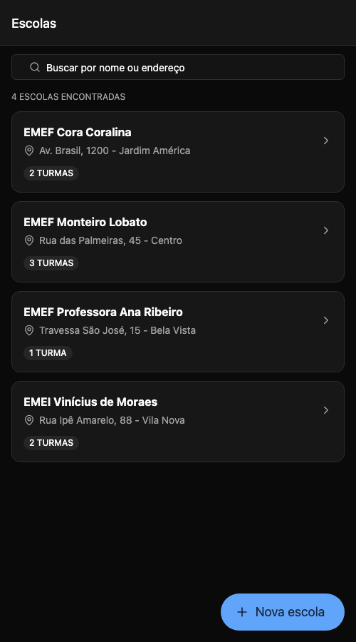
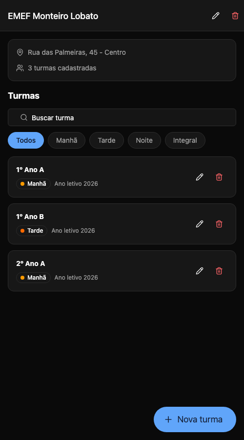
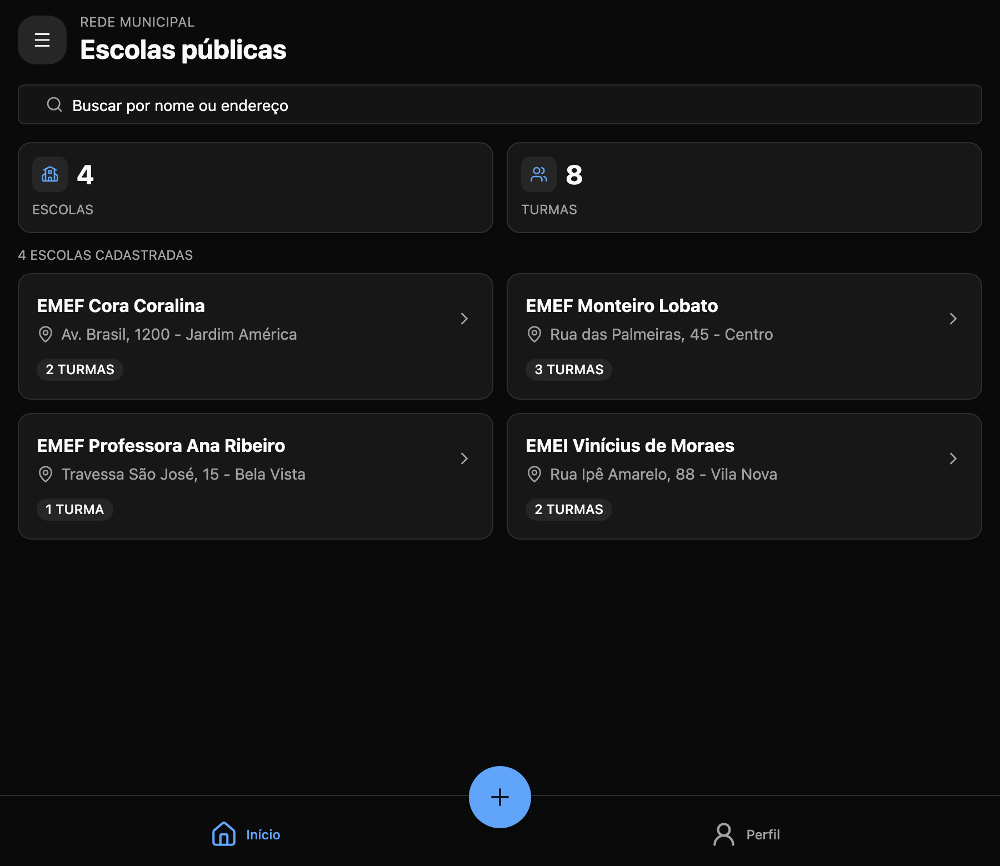

# Escolas

Aplicativo mobile (Android/iOS, com suporte a web) para cadastro e gestão de escolas públicas e suas turmas, desenvolvido como solução para o desafio técnico de React Native.

O back-end é simulado com MirageJS rodando dentro do próprio app, com persistência local via AsyncStorage — os dados criados sobrevivem ao fechamento do app.

## Stack e versões

| Ferramenta | Versão |
| --- | --- |
| Node | >= 20.19 |
| Expo SDK | 54 |
| React Native | 0.81 |
| React | 19.1 (React Compiler habilitado) |
| TypeScript | 5.9 (strict) |
| Expo Router | 6 (typed routes) |
| gluestack-ui | v5 (UniWind / Tailwind CSS v4) |
| TanStack Query | 5 |
| Zustand | 5 |
| MirageJS | 0.1 |
| React Hook Form + Zod | 7 / 4 |
| FlashList | 2 |
| Jest (jest-expo) + Testing Library | 29 / 13 |

## Como rodar

Pré-requisitos: Node 20.19+ e npm (desenvolvido com Node 22 via `nvm use 22`).

```bash
npm install
npx expo start
```

Com o servidor de desenvolvimento aberto:

- **i** abre o simulador iOS (macOS com Xcode)
- **a** abre o emulador Android
- **w** abre no navegador
- ou escaneie o QR code com o app **Expo Go** (App Store / Play Store) — o SDK 54 é compatível com a versão pública do Expo Go

### Mock de back-end

Não há passo extra: o MirageJS sobe junto com o app (ver `src/mocks/server.ts`) e intercepta as chamadas HTTP feitas para `/schools` e `/classes`. Ele simula latência de rede (350ms), valida os payloads com os mesmos schemas Zod do domínio (retornando 422/404 como uma API real) e persiste o banco em AsyncStorage.

Para voltar ao estado inicial (seeds), limpe os dados do app no dispositivo/emulador ou desinstale e instale novamente.

### Scripts

```bash
npm start          # expo start
npm test           # testes unitários (jest)
npm run lint       # eslint (config do expo)
npm run typecheck  # tsc --noEmit
```

## Funcionalidades

Escolas
- listagem com busca (nome ou endereço), contagem de turmas e pull-to-refresh
- cadastro, edição e exclusão (com confirmação; excluir a escola remove as turmas vinculadas)

Turmas
- listagem por escola com busca e filtro por turno
- cadastro, edição e exclusão (nome, turno e ano letivo)

Extras
- persistência offline dos dados (AsyncStorage)
- layout responsivo (a lista de escolas vira grid de 2 colunas em tablets)
- tema claro/escuro seguindo o sistema
- estados de carregamento, erro (com retry), vazio e vazio-com-filtros em todas as listas
- feedback por toast nas operações e validação de formulários em tempo real

## Estrutura do projeto

```
src/
  app/                      # rotas (expo-router) — apenas composição de tela
    index.tsx               # lista de escolas
    schools/
      new.tsx               # modal de cadastro
      [id]/
        index.tsx           # detalhe da escola + turmas
        edit.tsx            # modal de edição
        classes/            # cadastro/edição de turmas
  components/               # componentes compartilhados (estados, diálogo, busca...)
    ui/                     # componentes do gluestack-ui (gerados pelo CLI)
  domain/                   # entidades e schemas zod (fonte única de validação)
  features/
    schools/                # componentes e hooks do módulo de escolas
    classes/                # componentes e hooks do módulo de turmas
  hooks/                    # hooks utilitários (debounce, toast)
  lib/                      # http client, query client, query keys, formatação
  mocks/                    # servidor mirage, seeds e persistência
  repositories/             # acesso à API (padrão repository)
  stores/                   # estado global de UI (zustand)
```

## Decisões de arquitetura

- **Server state vs client state**: dados da API ficam no TanStack Query (cache, invalidação, refetch, estados de loading/erro); o Zustand guarda apenas estado de UI que precisa sobreviver à navegação (busca da listagem). Isso evita duplicar a "verdade" dos dados em dois lugares.
- **Repository pattern**: as telas não conhecem `fetch` nem URLs. Elas usam hooks (`useSchools`, `useCreateClass`...), que usam repositories, que usam um http client único com tratamento de erro padronizado (`ApiError`). Trocar o Mirage por uma API real é alterar só a base URL.
- **Validação compartilhada**: os schemas Zod de `src/domain` são usados no formulário (via `zodResolver`) e no "servidor" Mirage — o mock se comporta como um back-end que valida de verdade.
- **Fallbacks**: erro de rede vira mensagem amigável com botão de retry; snapshot corrompido no storage é descartado e o app sobe com os seeds; erro de renderização cai no `ErrorBoundary` do expo-router.
- **Performance**: FlashList nas listagens, React Compiler (elimina a necessidade de `useMemo`/`useCallback` manuais), busca com debounce de 300ms e `keepPreviousData` para não piscar a lista ao digitar.

## Testes

```bash
npm test
```

Cobrem os schemas de domínio, o http client (sucesso, erros de API, falha de rede), a store de filtros, o hook de debounce, o schema do formulário de turma e o componente de card de escola (31 testes).

## Prints

Capturas da versão web do app (tema escuro, seguindo o sistema):

| Escolas | Turmas da escola |
| --- | --- |
|  |  |

Em telas largas a listagem vira grid:


